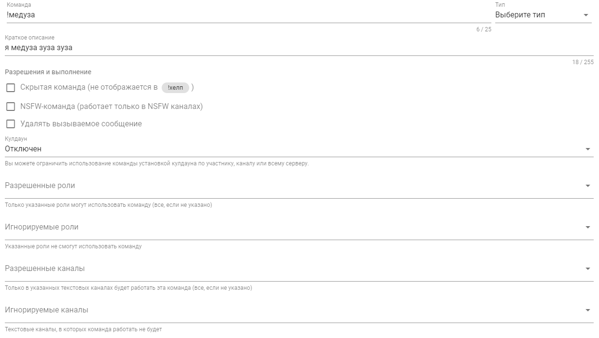

# Пользовательские команды

Пользовательские команды \(кастомные команды\) создаются и настраиваются в [панели управления](../../#configure) сервера во вкладке с названием "польз. команды". Любую пользовательскую команду можно отключить при необходимости и настроить необходимые права доступа аналогично встроенным командам бота.

## Интерфейс настроек

У каждой команды вне зависимости от её типа есть определенный набор общих настроек:

* **Команда** — имя команды, по которому она будет вызываться в Discord;
* **Тип** — выбор типа команды, подробное описание которых вы найдете в подразделах;
* **Краткое описание** — просто краткое описание данной команды, которое отображается в списке пользовательских команд, а также в справке самого бота в Discord;
* **Раздел "Разрешения и выполнение"** — описывает поведение команды и права доступа к ней по ролям и каналам.

## Типы команд

1. **Сообщение** — на вызов такой команды бот ответит указанным текстом или панелью \(embed\).
2. **Перенаправление** — вызов такой команды перенаправляется \(переадресовывается\) на другую команду, указанную в теле этой пользовательской команды. Например, если вы создадите команду с именем `я`, и в теле напишите `юзер`, вызов команды `!я` будет аналогичен вызову встроенной команды `!юзер`. Перенаправление работает только на встроенные в бота команды!
3. **Изменение ролей** — вызов такой команды будет снимать или выдавать указанные в настройках команды роли, но только участнику, который вызвал эту команду. По умолчанию роли изменяются тому участнику, кто вызвал команду.

