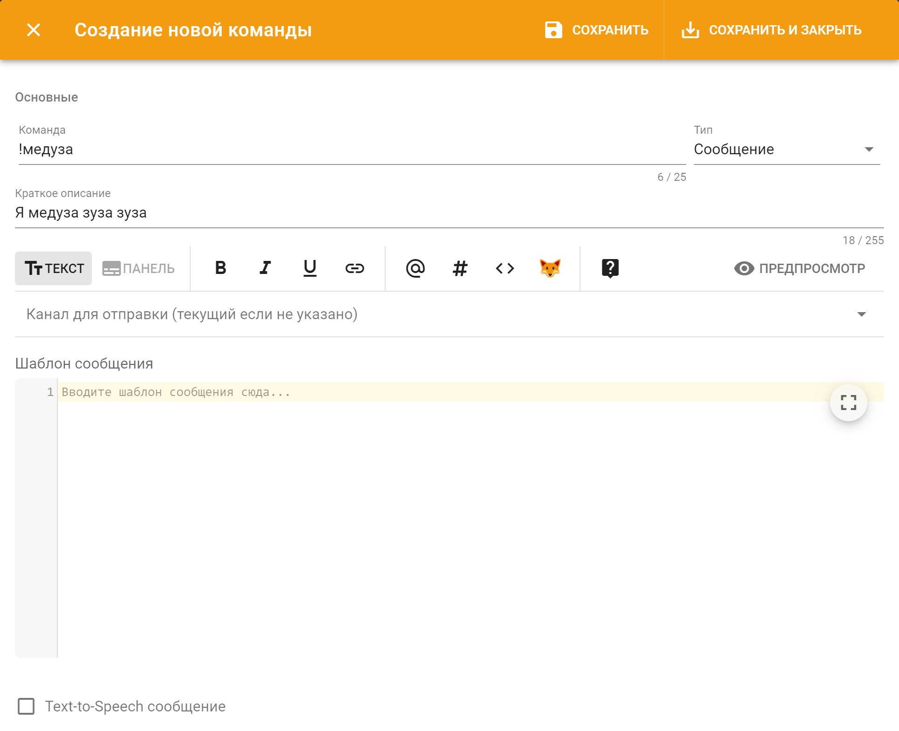

# Сообщение

## Чем полезно? 

Вы можете использовать этот тип команд для предоставления пользователям какой-нибудь полезной информации в текстовом виде или в красиво оформленной рамочке, называемой панелью. Вместе с этим вы можете настроить выдачу ролей по нажатию на реакцию.

## Поведение и настройки 

В пользовательской команде-сообщении используется стандартный [интерфейс шаблонов сообщений](../../features/message-templates/ui.md) с дополнительной возможностью указания реакций к сообщению и ролей за их нажатие.

## Пример 

Допустим, Вам нужна простая команда, в ответ на которую бот будет писать какой-нибудь текст в канал. Для создания такой команды: 

1. Зайдите в настройки пользовательских команд в [панели управления](../../#configure);
2. Нажмите кнопку "Добавить команду":

Откроется диалог создания новой пользовательской команды: 

В поле "Канал для отправки" можно выбрать канал, в который бот будет отвечать. Если канал не указан, то отправляться будет в тот, в котором прописана команда.  
  
В поле "Шаблон сообщения" пишется текст, которым будет отвечать бот.   
  
Давайте создадим команду, которая повторяет за вами текст:

1. Даем имя нашей команде, например "скажи";
2. Выбираем тип команды "Сообщение";
3. В шаблоне сообщения пишем `{{ arguments }}`. `{{ arguments }}` - это текст, который будет введен пользователем после написания команды;
4. Сохраняем команду.

Вот и всё! Теперь можно прописать `!скажи фыр` и бот ответит вам "фыр"!

