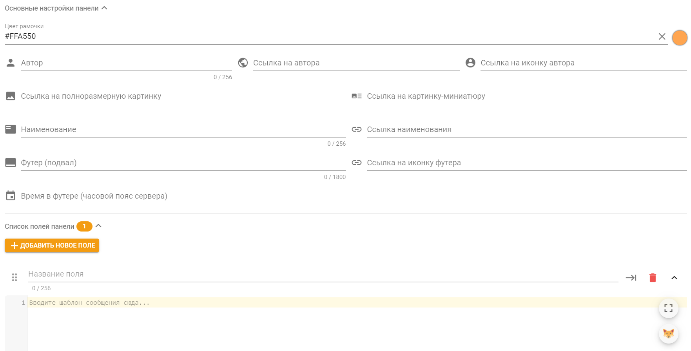
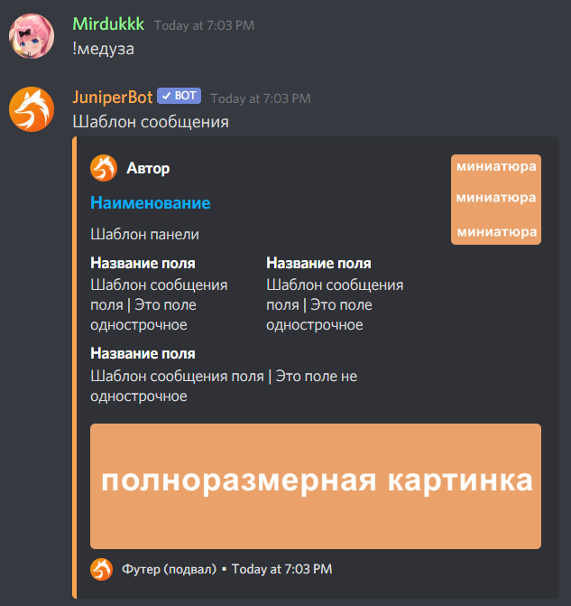

# Сообщение

## Зачем это нужно?

Вы можете использовать этот тип команд для предоставления пользователям какой-нибудь полезной информации в текстовом виде или в красиво оформленной рамочке, называемой панелью. Вместе с этим вы можете настроить выдачу ролей по нажатию на реакцию.

## Поведение и настройки

В этом типе команды можно выбрать два режима отправки — текст и панель:

### Режим "Текст"

Цифрами обозначены элементы интерфейса, к которым есть пояснение ниже:  
  
1 — Переключатель между первым и вторым режимом отправки;  
2, 3, 4, 5 — Форматирование текста внутри шаблона сообщения жирным, наклонным подчеркнутым или ссылкой соответственно. Для использования выделите нужную часть текста в шаблоне сообщения и нажмите желаемую кнопку форматирования;  
6 — Кнопка вставки упоминания роли в сообщение;  
7 — Кнопка вставки упоминания канала в сообщение;  
8 — Выбор шаблонов для шаблонизатора;  
9 — Emoji Picker. Здесь можно выбрать стандартные или серверные смайлики, если вы хотите использовать их в своем сообщении \(серверные смайлики находятся в самом низу списка\);  
10 — Кнопка открытия документации пользовательских команд;  
11 — Кнопка предпросмотра сообщения. Нажав на неё, можно посмотреть как примерно будет выглядеть сообщение после отправки в Discord;   
12 — Выбор канала для отправки этого сообщения. Если канал не указан, сообщение будет отправлено в канал вызова этой команды;  
13 — Сам текст сообщения. Здесь можно использовать различные [переменные шаблонов](../../features/message-templates/advanced/types.md), здесь выполняется код [шаблонного движка](https://docs.juniper.bot/features/template-engine);  
14 — Кнопка, которая растянет шаблон сообщения на всю площадь страницы;  
15 — Галочка, которая позволяет включить режим озвучивания сообщения специальным роботом-хомяком;  
16 — Поле, в котором можно указать количество секунд, по прошествии которых сообщение будет удалено;  
17 — Галочка, которая позволяет включить режим выдачи ролей только за последнюю нажатую реакцию \(при нажатии на две реакции сразу, бот даст роль только за последнюю нажатую реакцию\);  
18 — Функциональность выдачи ролей за реакции. Эта функция доступна только тем, кто [поддерживает](https://juniper.bot/donate) бота.

### Режим "Панель"

В данном режиме бот будет отправлять сообщение в виде панели \(так называемый embed\). Интерфейс настроек в целом аналогичен режиму текста, но дополняется полями для текста внутри панели и множеством других настроек панели:

**Цвет рамочки** — это цвет полоски слева панели. Всё остальное можно посмотреть на скриншоте ниже, где все поля подписаны своим именем.

Поля "Автор" и "Наименование" могут содержать в себе ссылку, которую можно указать в настройках панели "Ссылка на автора" и "Ссылка наименования" соответственно.  
  
Если вы хотите использовать какие-либо картинки в панели, ссылки на эти картинки должны быть прямыми. Например, [https://imgur.com/a/zdoSlIO](https://imgur.com/a/zdoSlIO) — ссылка на сайт с картинкой, такая ссылка не подходит. А вот [https://i.imgur.com/PaTD1ar.jpg](https://i.imgur.com/PaTD1ar.jpg) — ссылка на саму картинку. Именно такие ссылки нужно указывать.  
  
Если вы хотите встроить ссылку в текст внутри шаблона панели, это можно сделать написав следующим образом: `[текст](ссылка)`. Нужно писать без пробела между скобочками.  
  
Однострочные поля — это поля, которые по возможности не переносятся на следующую строку.  
  
Внутри любых настроек панели можно использовать [переменные шаблонов](../../features/message-templates/advanced/types.md). Например, если вы хотите, чтобы на месте иконки автора была аватарка участника, который вызвал эту команду, в "Ссылка на иконку автора" нужно прописать `{{ member.avatarUrl }}`.

