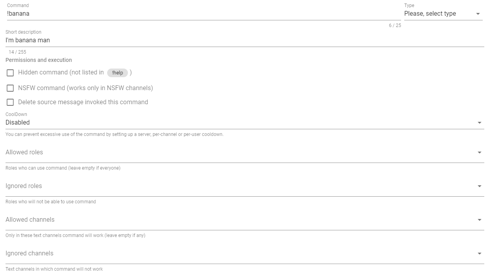

# Custom commands

Custom commands can be created and configured at the server's [control panel](https://docs.juniper.bot/v/english/#configure-bot-for-your-needs) in the tab called "custom commands". You can disable any custom command if necessary and configure the necessary access rights in the same way as the built-in bot commands.

## Settings interface

Each command has a certain set of general settings regardless of its type:

* **Command** — the name of the command that will be used to call it in Discord;
* **Type** — type of command. You can find detailed descriptions for each of them just below in next section as well as other pages within this category;
* **Short description** — just a short description of this command, which is displayed in the list of custom commands, as well as in the list inside Discord, accessible by command `!help custom`;
* **Section "Permissions and execution"** — describes the behavior of the command and access rights to it by roles and channels.

## Command types

1. **Message** — invocation of such will result in simple response with specified text or embed. 
2. **Alias** — invocation of such command will be redirected to another command specified in the body of this custom command. For example, if you create a command with the name `me`, enter the `user` in the body, invocation of `!me` will be similar to invocation the built-in command `!user`. Redirection only works on the bot's built-in commands! 
3. **Changing roles** — invocation of such command will remove or add the roles specified in the command settings. By default, this can only be done by the member who called this command.

