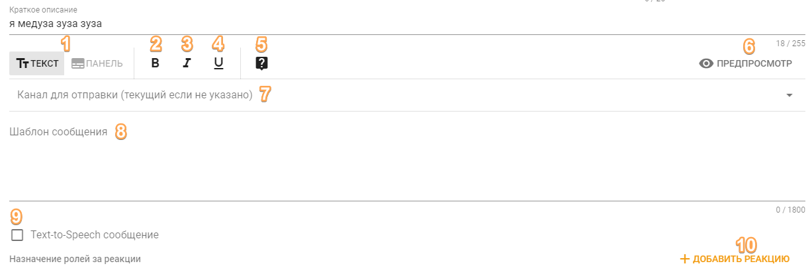

# Сообщение

## Зачем это нужно?

Вы можете использовать этот тип команд для предоставления пользователям какой-нибудь полезной информации в текстовом виде или в красиво оформленной рамочке, называемой панелью. Вместе с этим вы можете настроить выдачу ролей по нажатию на реакцию.

## Поведение и настройки

В этом типе команды можно выбрать два режима отправки — текст и панель:

### Режим "Текст"

Цифрами обозначены элементы интерфейса, к которым есть пояснение ниже:  
  
1 — Переключатель между первым и вторым режимом отправки;  
2, 3, 4 — Форматирование текста внутри шаблона сообщения жирным, наклонным или подчеркнутым соответственно. Для использования выделите нужную часть текста в шаблоне сообщения и нажмите желаемую кнопку форматирования;  
5 — Кнопка открытия документации пользовательских команд.  
6 — Кнопка предпросмотра сообщения. Нажав на неё, можно посмотреть как примерно будет выглядеть сообщение после отправки в Discord;  
7 — Выбор канала для отправки этого сообщения. Если канал не указан, сообщение будет отправлено в канал вызова этой команды;  
8 — Сам текст сообщения. Здесь можно использовать различные [переменные шаблонов](../../misc/template-variables.md);  
9 — Галочка, которая позволяет включить режим озвучивания сообщения специальным роботом-хомяком;  
10 — Функциональность выдачи ролей за реакции. Эта функция доступна только тем, кто [поддерживает](https://juniper.bot/donate) бота.

### Режим "Панель"

В данном режиме бот будет отправлять сообщение в виде панели \(так называемый embed, rich embed\). Интерфейс настроек в целом аналогичен режиму текста, но дополняется полями для текста внутри панели и множеством других настроек панели:

**Цвет рамочки** — это цвет полоски слева панели. Всё остальное можно посмотреть на скриншоте ниже, где все поля подписаны своим именем.

Поля "Автор" и "Наименование" могут содержать в себе ссылку, которую можно указать в настройках панели "Ссылка на автора" и "Ссылка наименования" соответственно.  
  
Если вы хотите встроить ссылку в текст внутри шаблона панели, это можно сделать написав следующим образом: `[текст](ссылка)`. Нужно писать без пробела между скобочками.  
  
Однострочные поля — это поля, которые не переносятся до тех пор, пока панель не займет собой всю ширину чата.  
  
Внутри любых настроек панели можно использовать [переменные шаблонов](../../misc/template-variables.md). Например, если вы хотите, чтобы на месте иконки автора была аватарка человека, который вызвал эту команду, в "Ссылка на иконку автора" нужно прописать `{member.avatarUrl}`.

