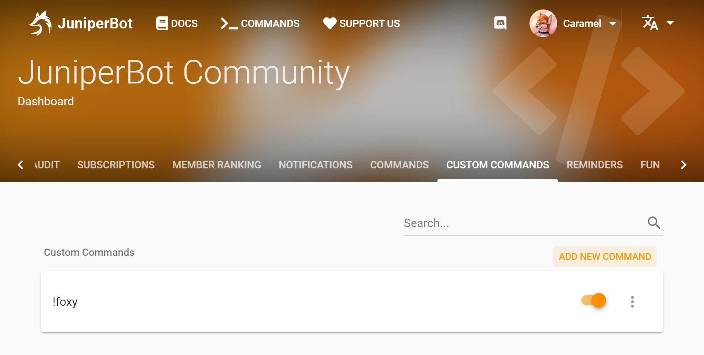
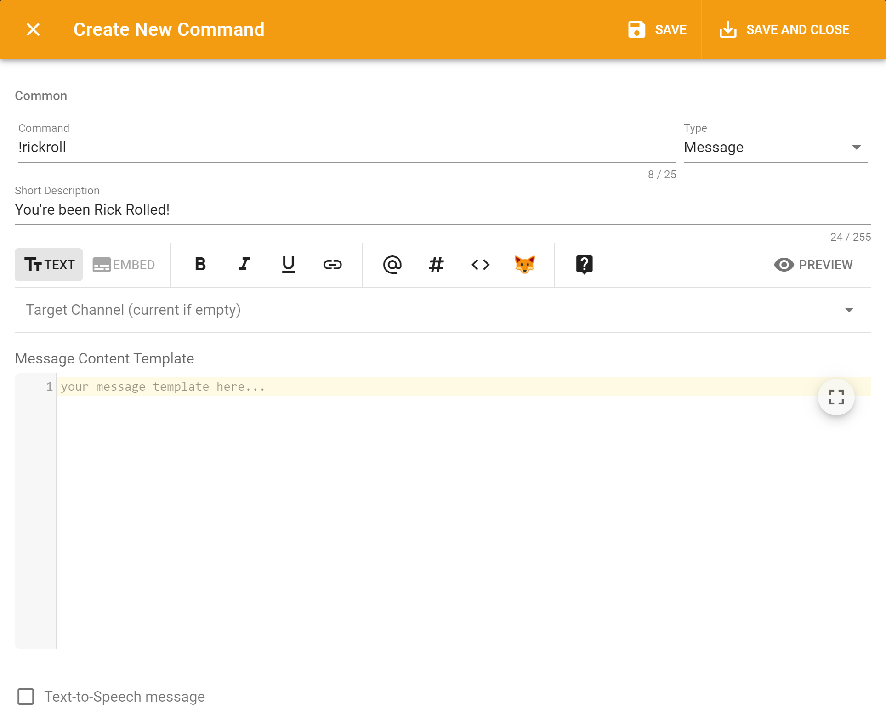

# Message

## How it is useful? 

You can use this type of command to provide users with some useful information in text form or in a beautifully designed embed. At the same time, you can configure roles add/remove by clicking on reactions.

## The behavior and settings 

Message custom command uses default [Message Template interface](../../features/message-templates/ui.md) with additional option to add reaction roles.

## Example

Let's say you need a simple command that responses back with some text. You can create it simply:

1. Go to [server's dashboard](../../#configure) and custom commands tab of your server;
2. Click "Add new command" button:

A command create dialog will open:

You can pick the target channel where the response will be sent or leave it empty so it will be sent in the channel where the command invoked.

"Message Content Template" is the exact content which bot will send back.

Let's create a "say" command:

1. Enter command name "say";
2. Pick the "Message" command type;
3. In "Message Content Template" enter `{{ arguments }}`. It it will be replaced to the exact text you are entered with the command.
4. Save the command;

Done! Now if you enter command `!say YIP` the bot will respond you "YIP"!

