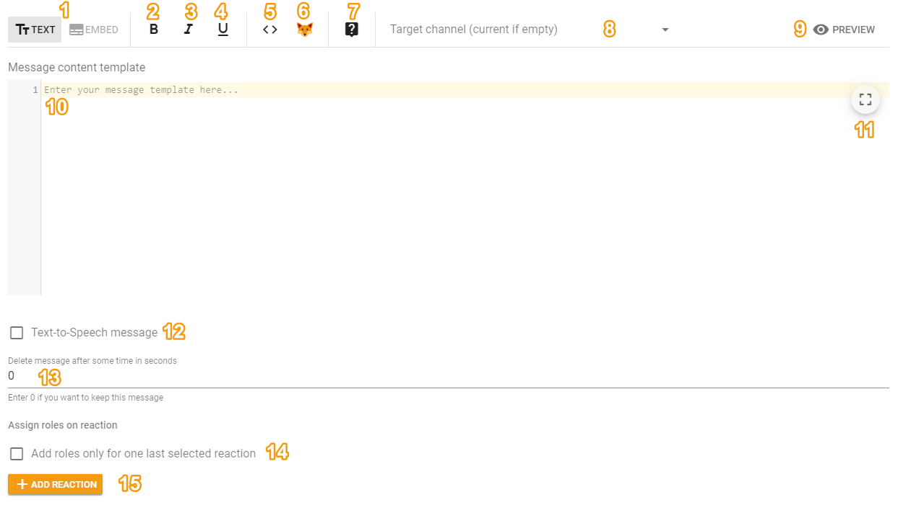

# Message

## How it is useful? 

You can use this type of command to provide users with some useful information in text form or in a beautifully designed embed. At the same time, you can configure roles granting by clicking on reactions.

## The behavior and settings 

In this type of command, you can choose two sending modes — text and embed:

### Mode "Text" 

Numbers indicates interface elements, which are explained below:

1 — Switch between the first and second sending mode;   
2, 3, 4 — Formatting the text inside the message template as bold, italic or underlined, respectively. To use it select the desired part of the text in the message template and click the desired formatting button;   
5 — Selecting templates for the template engine;  
6 — Emoji Picker. Here you can choose standard or server emojis if you want to use them in your message \(server emojis are at the bottom of the list\);   
7 — Button to open documentation for custom commands;   
8 — Selection of the channel to send this message to. If the channel is not specified, the message will be sent to the channel where this command was invoked.  
9 — Preview Button of the message. By clicking on it, you can see how the message will look on the Discord;  
10 — The message text. You can use various [template variables](https://docs.juniper.bot/v/english/features/template-variables) here;   
11 — Button that will stretch the message template to the entire page area;  
12 — A check Mark that allows you to enable the Text-to-Speech of the message by a special hamster robot;   
13 — A Field where you can specify the number of seconds after which the message will be deleted;   
14, 15 — Functionality for assigning roles for reactions. This feature is only available to those who [supporting](https://juniper.bot/donate) the bot.

### Mode "embed" 

The **embed color** is the color of the stripe on the left of the embed. Everything else can be seen in the screenshot below, where all the fields are signed with their own name:

The "Author" and "Title" fields can contain a link, which can be specified in the "author Link" and "title Link" settings of the embed, respectively.

If you want to use any images in embed, the links to these images must be direct. For example, [https://imgur.com/a/zdoSlIO](https://imgur.com/a/zdoSlIO) — link to a site with an image, this link is not suitable. And here [https://i.imgur.com/PaTD1ar.jpg](https://i.imgur.com/PaTD1ar.jpg) — link to the image. These are the links you need to specify there.

If you want to embed a link in the text inside the embed template, you can do this by writing: `[text](link)`. You need to write it without a space between brackets.

Inline fields — these are fields that are inlined into the same row if possible.

You can use [template variables](https://docs.juniper.bot/v/english/features/template-variables) inside any embed values. For example, if you want to replace the author's icon with the avatar of the member who called this command, in "Link to the author's icon" you need to enter `{{ member.avatarUrl }}` there.

