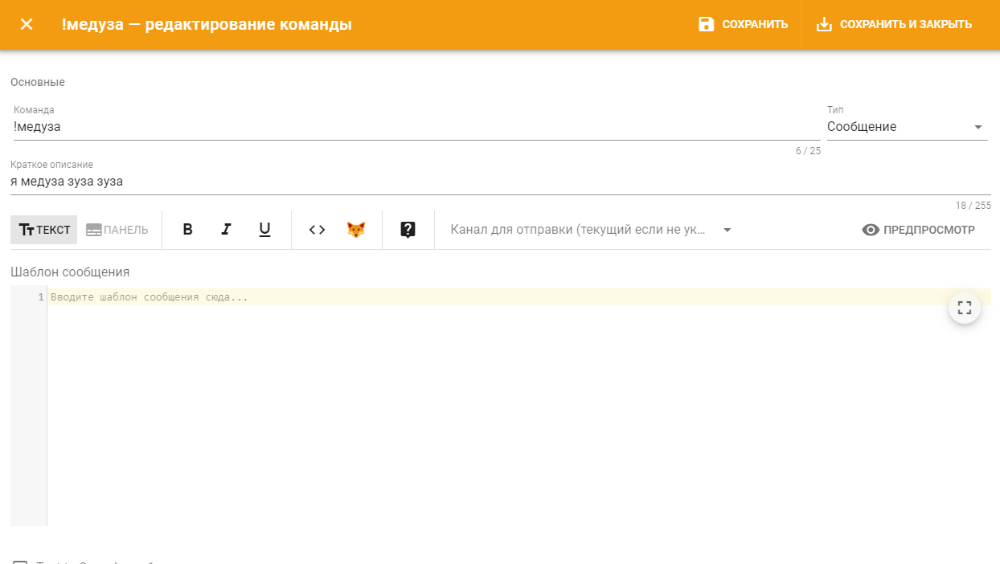

# Создание простой команды

Допустим, Вам нужна простая команда, в ответ на которую бот будет писать какой-нибудь текст в канал. Для создания такой команды: 

1. Зайдите в настройки пользовательских команд в [панели управления](../../#configure);
2. Нажмите кнопку "Добавить команду":

Откроется диалог создания новой пользовательской команды: 

В поле "Канал для отправки" можно выбрать канал, в который бот будет отвечать. Если канал не указан, то отправляться будет в тот, в котором прописана команда.  
  
В поле "Шаблон сообщения" пишется текст, которым будет отвечать бот.   
  
Итак, настраиваем команду:

1. Даем имя нашей команде, например "скажи";
2. Выбираем тип команды "Сообщение";
3. В шаблоне сообщения пишем `{{ arguments }}`. `{{ arguments }}` - это текст, который будет введен пользователем после написания команды, например при вызове команды "!скажи фыр" - `{{ arguments }}` будет заменён на "фыр".
4. Сохраняем команду.

Вот и всё! Теперь можно прописать `!скажи фыр` и бот ответит вам "фыр"! 


* Подробнее о типах пользовательских команд можно ознакомиться в [основном разделе](./).
* `{{ arguments }}`— одна из множества доступных [переменных шаблонов](../../features/template-variables/).


