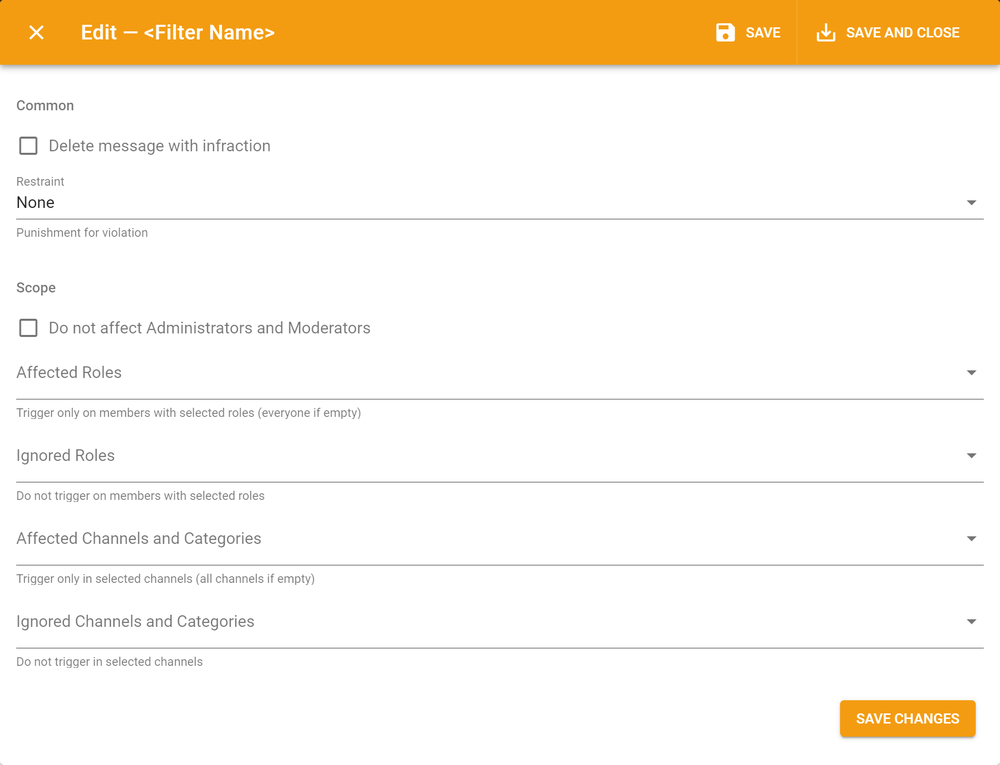

# Auto-Moderation

## Filters 

Filters are special triggers in moderation settings of [server's dashboard](../../#configure) resposible for certain actions:

* **Links** — triggers to unwanted links;
* **Bad Words** — triggers to unwanted words in messages;
* **Repeated Text** — triggers to specified amount of equal messages \(flood\) from the same member;
* **Caps Lock** — triggers to excessive CAPS LOCK in messages;
* **Emotes** — triggers to excessive amount of emotes in the single message \(not reactions!\);
* **Mentions** — triggers to excessive amount of channel and members mention in the single message;
* **Zalgo** — triggers to z͍͖̟a̶̠l̩̗͖̻̭g̬̦̳̤̞̟͜o̝̬̳̺̱͙͘ text in messages.

Those filters have the general settings:

* **Restraint** — is the punishment action that will be applied to violator;
* **Do not affect Administrators and Moderators** — allows to disable this filter for server's owner, members with Administrator permission and moderator roles specified in the moderation settings of [server's dashboard](../../#configure);
* **Affected Roles** — filter will be applied to members with specified roles. Will be applied to everyone if empty;
* **Ignored Roles** — filter will not trigger any actions for roles specified here;
* **Affected Channels and Categories** — filter will be applied only to specified text channels. Any channel if empty;
* **Ignored Channels and Categories** — filter will not trigger for specified text channels. 

Also, every filter has a [message template](../message-templates/ui.md) that will be sent once its triggered with some additions:

* \*\*\*\*[**{{infraction.\*}}**](../message-templates/advanced/types.md) — are template variables with some detailed information about violation. For example, a link triggered the link filter.

