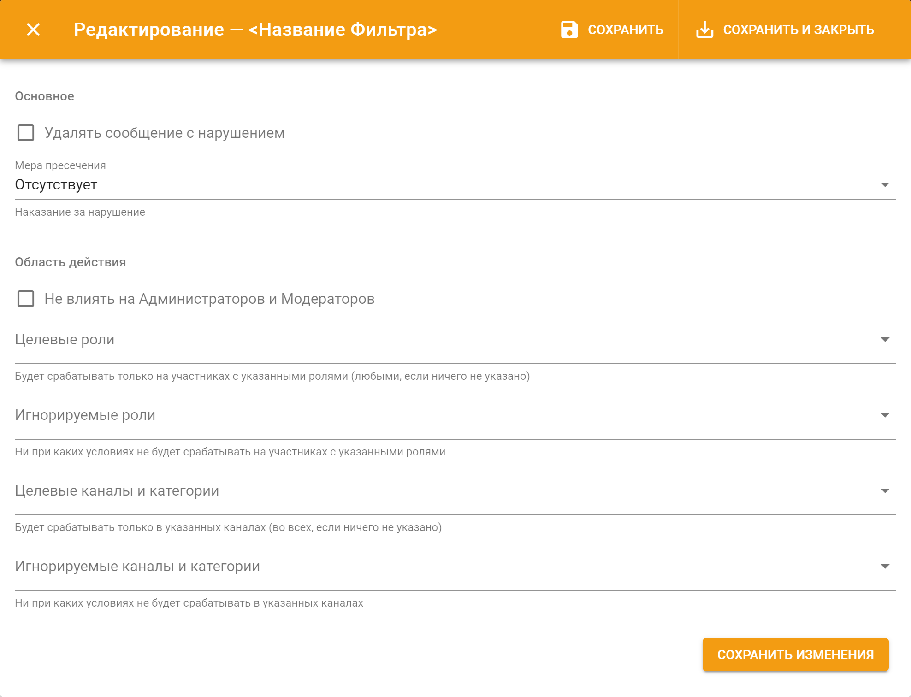

# Автомодерация

## Фильтры автомодерации 

Это специальные триггеры в настройках модерации [панели управления](../../#configure), которые отвечают за определенные действия:

* **Ссылки** — реагирует на нежелательные ссылки;
* **Плохие слова** — реагирует на нежелательные слова;
* **Повторяемый текст** — реагирует на указанное количество одинаковых сообщений \(флуд\) от одного участника;
* **Caps Lock** — реагирует на злоупотребление участниками БОЛЬШИХ БУКВ в сообщениях;
* **Эмоции** — реагирует на злоупотребление эмоциями \(смайлики, эмодзи\) в сообщениях \(не реакции!\);
* **Упоминания** — реагирует на злоупотребление упоминаниями определенного типа. Например, \#каналов или @пользователей;
* **Zalgo** — реагирует на п̆̐̕о́͑̔̕̚д͒̀̄̎̒͝о̛̆̓͊б̈̔̕н͋̆͋̌͋͝ы̌͊̇̓̚͝й̍̂͝ текст в сообщении.

Все эти фильтры имеют общие настройки:

* **Мера пресечения** — меню, в котором можно выбрать какое действие фильтр применит к нарушителю;
* **Не влиять на Администраторов и Модераторов** — позволяет отключить работу фильтра для владельца сервера, участников с правом Администратора, а так же модераторов \(участников, у которых есть роли, указанные в настройках модерации как роли модераторов\);
* **Целевые роли** — позволяет выбрать роли, на которые будет действовать фильтр. Если ничего не указать, фильтр будет работать на всех участников;
* **Игнорируемые роли** — позволяет выбрать роли, на которые не будет действовать фильтр;
* **Целевые каналы и категории** — позволяет выбрать текстовые каналы, в которых будет работать фильтр. Если ничего не указать, фильтр будет действовать во всех каналах;
* **Игнорируемые каналы и категории** — позволяет выбрать текстовые каналы, в которых не будет работать фильтр. 

Кроме того, у всех фильтров есть возможность отправки уведомления о нарушении в момент обнаружения этого нарушения и представляет собой стандартный [шаблон сообщений](../message-templates/ui.md). В дополнение к этому, у фильтров внутри этих настроек есть следующие особенности:

* \*\*\*\*[**{{infraction.\*}}**](../message-templates/advanced/types.md) — это переменные шаблонов, которые содержат в себе некоторую полезную информацию о нарушении. Например, ссылка, на которой сработал фильтр;

