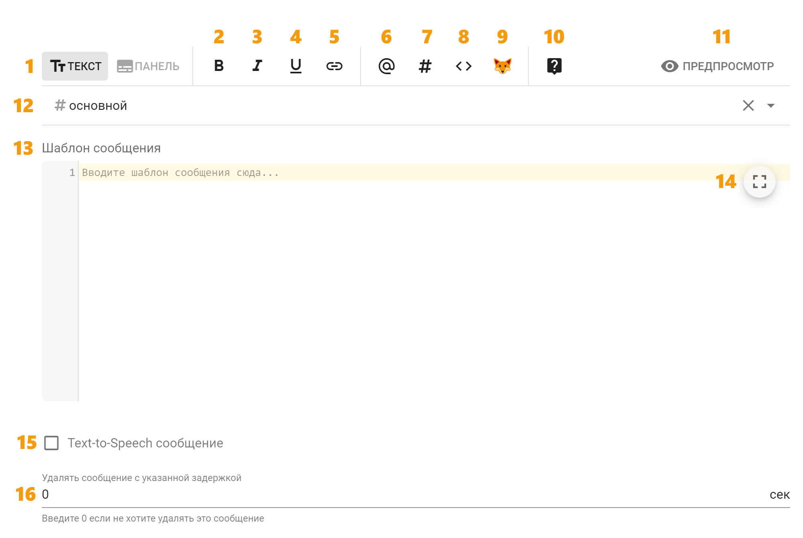
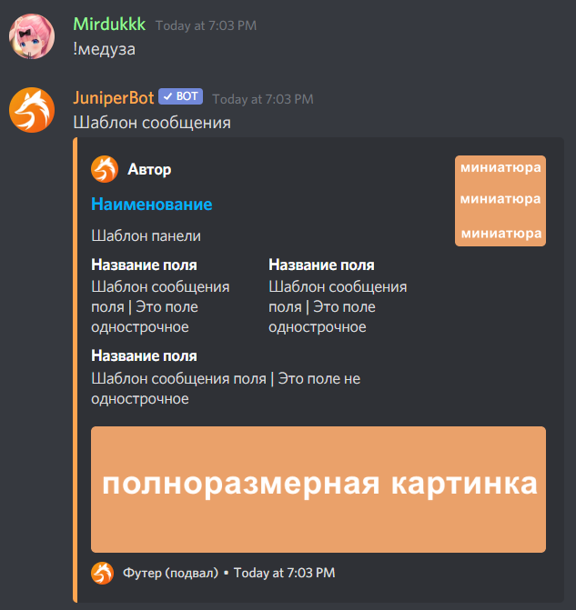

# Интерфейс

Интерфейс настроек шаблона сообщений выглядит следующим образом:

| Номер | Пояснение |
| :---: | :--- |
| 1 | Переключатель режимов отправки сообщения: [Текст](ui.md#text-mode) и [Панель](ui.md#embed-mode) |
| 2-5 | Форматирование текста внутри шаблона сообщения жирным, наклонным подчеркнутым или ссылкой соответственно. Для использования выделите нужную часть текста в шаблоне сообщения и нажмите желаемую кнопку форматирования |
| 6 | Вставка упоминания роли |
| 7 | Вставка упоминания канала |
| 8 | Вставка наиболее часто используемых переменных |
| 9 | Вставка эмоций. Здесь можно выбрать стандартные или серверные смайлики, если вы хотите использовать их в своем сообщении \(серверные смайлики находятся в самом низу списка\) |
| 10 | Документация по шаблонам сообщений |
| 11 | Предпросмотр сообщения. Нажав на неё, можно посмотреть как примерно будет выглядеть сообщение после отправки в Discord |
| 12 | Выбор канала для отправки этого сообщения. Если канал не указан, сообщение будет отправлено в канал вызова \(команды/события\) |
| 13 | Сам текст сообщения. Здесь можно использовать различные переменные шаблонов и остальные возможности шаблонного движка |
| 14 | Кнопка входа в полноэкранный режим |
| 15 | Включение режима озвучивания сообщения специальным роботом-хомяком |
| 16 | Количество секунд, по прошествии которых сообщение будет удалено \(0 означает, удаляться не будет\) |

## Режим "Текст" 

В данном режиме обработанный шаблон сообщения будет отправлен в канал обычным текстом как его пишете вы.

## Режим "Панель" 

В данном режиме бот будет отправлять сообщение в виде панели \(так называемый embed\). Основной интерфейс настроек в целом аналогичен режиму текста, но дополняется полями для текста внутри панели и множеством других настроек панели:

**Цвет рамочки** — это цвет полоски слева панели. Всё остальное можно посмотреть на скриншоте ниже, где все поля подписаны своим именем.

Поля "Автор" и "Наименование" могут содержать в себе ссылку, которую можно указать в настройках панели "Ссылка на автора" и "Ссылка наименования" соответственно.  
  
Если вы хотите использовать какие-либо картинки в панели, ссылки на эти картинки должны быть прямыми. Например:

* [https://imgur.com/a/zdoSlIO](https://imgur.com/a/zdoSlIO) — ссылка на сайт с картинкой, такая ссылка **не подходит**.
* [https://i.imgur.com/PaTD1ar.jpg](https://i.imgur.com/PaTD1ar.jpeg) — прямая ссылка на саму картинку. Именно такие ссылки вам нужны.

Если вы хотите встроить ссылку в текст внутри шаблона панели, это можно сделать написав следующим образом: `[текст](ссылка)` или просто используйте кнопку вставки ссылки.  
  
Однострочные поля — это поля, которые по возможности не переносятся на следующую строку.  
  
Внутри любых настроек панели можно использовать переменные шаблонов. Например, если вы хотите, чтобы на месте иконки автора была аватарка участника, вставьте `{{ member.nickname }}` в поле "Автор" и `{{ member.avatarUrl }}` "Ссылка на иконку автора" и  .

