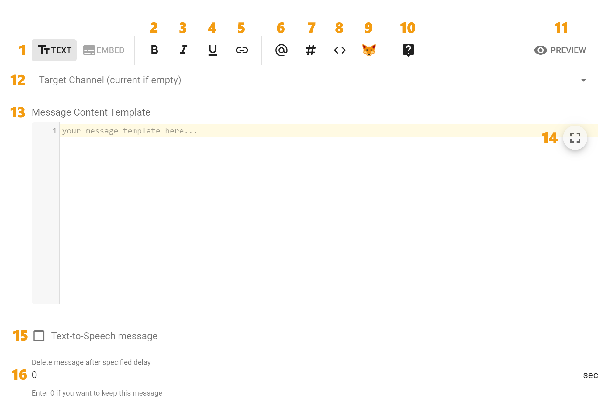
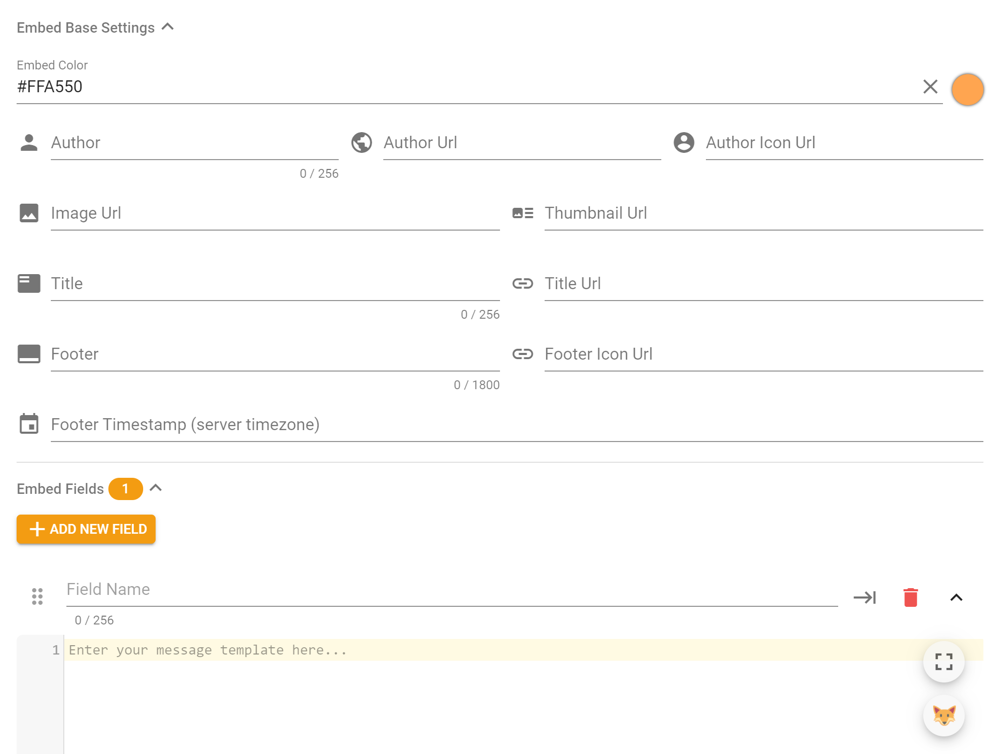

# User Interface

This is how Message Template user interface looks like:

| № | Description |
| :---: | :--- |
| 1 | Switch between message template mode: [Text](ui.md#text-mode) and [Embed](ui.md#embed-mode) |
| 2-5 | Formatting the text inside the message template as bold, italic, underlined and link respectively. To use it select the desired part of the text in the message template and click the formatting button |
| 6 | Insert role mention |
| 7 | Insert channel mention |
| 8 | Insert most used template variables |
| 9 | Insert Emoji. You can choose standard or server emojis if you want to use them in your message \(server emojis are at the bottom of the list\) |
| 10 | Message Templates Documentation |
| 11 | Preview resulting message. You can check how the message will look on the Discord |
| 12 | Select target channel to send this message template. If it is not specified, message will be sent to the default channel where the command invoked or event happened |
| 13 | Message content. You can use template variables as well as advanced template engine features |
| 14 | Full Screen mode switcher |
| 15 | Allows you to enable the Text-to-Speech of the message by a special hamster robot |
| 16 | The number of seconds after which the message will be deleted \(0 means it will not be deleted\) |

## Text Mode 

In this mode compiled message template will be sent to the channel as simple text just like you do it while chatting.

## Embed Mode 

In this mode compiled message template will be sent as Embed message\). It's basic interface is almost the same as text mode added the embed description content and embed-related settings:

The **embed color** is the color of the border line on the left of the embed. Everything else can be seen in the screenshot below, where all the settings are self-explanatory:

The "Author" and "Title" fields can contain a link, which can be specified in the "Author Url" and "Title Url" settings of the embed, respectively.

If you want to use images in embed, the links to these images must be direct. For example:

* [https://imgur.com/a/zdoSlIO](https://imgur.com/a/zdoSlIO) — is link to a website with an image, this link **is not suitable**;
* [https://i.imgur.com/PaTD1ar.jpg](https://i.imgur.com/PaTD1ar.jpeg) — is direct link to the image. This is the exact link type you need.

If you want to embed a link in the text inside the embed template, you can do this by writing: `[text](link)` or just use link insert button.

Inline fields — these are fields that are inlined into the same row if possible.

You can use template variables inside any embed values. For example, if you want to replace the author's icon with the avatar of the member, insert `{{ member.avatarUrl }}` "Avatar Url" field.

